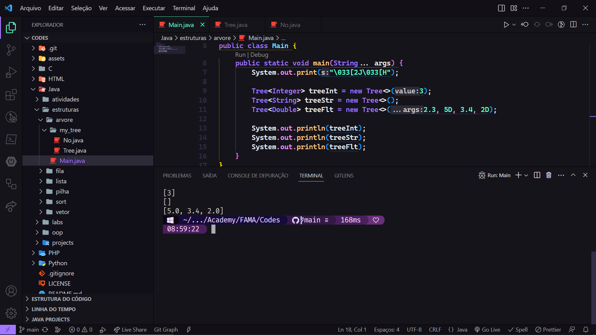

<div id="intro" align="center">
      <a href="#intro" title=" ">
            
      </a>
      <a href="#intro" title=" ">
            
      </a>
</div>

<div align="center">

```c
git clone https://github.com/QravaTTacker/fama.git
```

</div>
<div align="center">
  
  <br/>
  <br/>
</div>
<details>
<summary><em><strong>Diretórios 📂</strong></em></summary>

```
fama
├───C
│   ├───output
│   └───tests
├───HTML
│   ├───ex000_pixelart
│   │   ├───css
│   │   └───img
│   ├───ex001_loading
│   │   └───css
│   ├───ex002_atividade
│   │   ├───.vscode
│   │   ├───bootstrap
│   │   │   ├───css
│   │   │   └───js
│   │   ├───codes
│   │   ├───icons
│   │   ├───img
│   │   └───my-css
│   └───tests
│       └───links
│           ├───css
│           ├───icon
│           └───img
├───Java
│   ├───atividades
│   │   └───prova1
│   ├───estruturas
│   │   ├───arvore
│   │   │   └───my_tree
│   │   ├───fila
│   │   │   └───ex000
│   │   ├───lista
│   │   │   ├───dupla
│   │   │   └───simples
│   │   │       ├───ex000
│   │   │       ├───ex001
│   │   │       └───ex002
│   │   ├───pilha
│   │   │   └───ex000
│   │   ├───sort
│   │   │   ├───bubble
│   │   │   ├───insertion
│   │   │   ├───merge
│   │   │   ├───quick
│   │   │   ├───radix
│   │   │   ├───selection
│   │   │   └───shell
│   │   └───vetor
│   │       └───ex001
│   ├───labs
│   ├───oop
│   │   ├───bola
│   │   ├───calcular
│   │   │   ├───exemplos
│   │   │   └───expression
│   │   │       ├───operadores
│   │   │       └───operandos
│   │   ├───circulo
│   │   ├───circulo_gui
│   │   ├───conta
│   │   ├───conta_corrente
│   │   ├───fibonacci
│   │   ├───pessoa
│   │   ├───pessoa2
│   │   ├───produto
│   │   ├───quadrado
│   │   ├───retangulo
│   │   ├───revision
│   │   ├───tamagushi
│   │   ├───televisor
│   │   └───veiculo
│   └───projects
│       ├───ip
│       └───swing
├───PHP
│   ├───ex000
│   ├───ex001
│   ├───ex002
│   ├───ex003
│   │   ├───bootstrap
│   │   │   ├───css
│   │   │   └───js
│   │   ├───icons
│   │   └───my-css
│   ├───ex004
│   ├───ex005
│   │   └───classes
│   ├───ex006
│   ├───ex007
│   │   └───classes
│   │       └───contas
│   ├───ex008
│   │   ├───src
│   │   └───vendor
│   │       └───composer
│   └───tests
└───Python
    ├───lib
    │   └───__pycache__
    ├───tests
    │   └───lib
    │       └───__pycache__
    └───tkinter
        ├───icon
        └───img
```

</details>

## C

```C
#include <stdio.h>
#include <stdlib.h>

int main(void)
{
    fputs("Hello, FAMA!\n", stdout);
    return EXIT_SUCCESS;
}
```

<!-- gcc -Wall -Wextra -Werror - pedantic main.c -o main.exe -->

## Python

```Python
# -*- coding:utf-8 -*-


def main() -> None:
    print('Hello, FAMA!')


if __name__ == "__main__":
    main()
```

<!-- python main.py -->

## Java

```java
public class Main{
      public static void main(String[] args){
            System.out.println("Hello, FAMA!");
    }
}
```

<!-- javac Main.java -->
<!-- java Main -->

## PHP

```php
<?php
class Hello {
    public static $mgs = "Hello, FAMA!";
}

echo Hello::$mgs . "\n";
```

<!-- php main.php -->

## HTML + CSS

```html
<!DOCTYPE html>
<html lang="pt-BR">
  <head>
    <meta charset="UTF-8" />
    <meta name="viewport" content="width=device-width, initial-scale=1.0" />
    <title>Hello</title>
    <style>
      body {
        background-color: #15141b;
        color: #ccffcc;
        font-size: 30px;
      }
      section.my-sec {
        display: flex;
        justify-content: center;
      }
      span.green {
        color: #00ff00;
      }
    </style>
  </head>
  <body>
    <main>
      <section class="my-sec">
        <p>Hello, <span class="green">FAMA!</span></p>
      </section>
    </main>
  </body>
</html>
```

<!-- .\index.php -->
